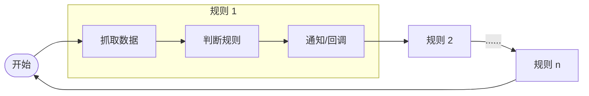
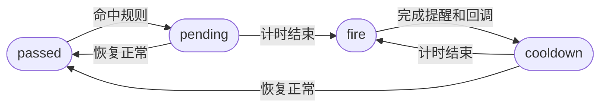

# GPU Watchdog

一个**零依赖**且**单文件**的 Linux 监控工具，用于监控 CPU、内存、磁盘、GPU 利用率、GPU 显存，以及 GPU 训练进程是否消失。

## 快速开始

不需要任何依赖，仅需 Python 3.8+ 原生库，并可构建为方便部署的 `.py` 单文件。针对 Linux 设计，部分兼容 Windows 和 macOS。

```bash
# 打印当前系统资源情况，测试程序是否可正常读取指标
python3 gpu_watchdog.py --samples

# 配置示例：空闲 GPU 自动提醒（适用于实验室公用服务器抢卡等场景）
python3 gpu_watchdog.py --config config_examples/idle_gpu_notification.json

# 配置示例：空闲 GPU 自动关机（适用于 AutoDL 等按量付费场景）
python3 gpu_watchdog.py --config config_examples/idle_auto_shutdown.json

# 配置示例：磁盘即将占满告警（防止盘满导致训练崩溃）
python3 gpu_watchdog.py --config config_examples/disk_full_notification.json

# 配置示例：训练进程崩溃告警（即使崩了也能及时收到通知）
python3 gpu_watchdog.py --config config_examples/crash_notification.json
```

省略 `--config` 时，程序会默认加载 `./config.json`，配置文件修改会自动热重载。完整配置示例可见 `config_examples/full_config.json`，详细配置见下文。

### 单文件用法

在 Linux 环境下使用脚本 `./build.sh` 构建生成单文件，生成结果储在 `dist/gpu_watchdog.py`，单文件的用法和正常版本完全一致。

单文件支持嵌入配置文件，以实现真正的一个 `.py` 文件直接运行，在生成的单文件顶部找到 `EMBEDDED_CONFIG` 参数，把 `config.json` 内容粘贴进去即可。

```python
EMBEDDED_CONFIG="""

"""
```

## 架构说明

程序会按配置顺序循环执行每条规则，每条规则包含数据采集、规则判断、通知/回调三步，执行所有规则后等待 n 秒后继续下一轮：



为了避免频繁通知，设计了简易的状态机，通过配置文件可以控制消息的发送频率，状态转移如下：



## 配置说明

### 1. 全局配置

```jsonc
{
  "interval_seconds": 30,  // 程序循环检查的时间间隔（秒），不包含规则执行时间
  "cooldown_seconds": 300, // 通知冷却时间（秒）
  "log_level": "INFO",     // 日志级别
}
```

### 2. 通知器

**LoggerNotifier**：将消息通知直接打印到日志，其中 WARNING 代表通知（reminder），CRITICAL 代表告警（alert），该通知器常开，无需配置。

**SMTPNotifier**：通过 SMTP 协议发送邮件通知，最通用的通知方式，适用于任何需要远程通知的场景。

```jsonc
{
  "notifiers": {
    "smtp": {
      "enabled": false,           // 是否启用
      "host": "smtp.example.com", // SMTP 服务器地址
      "port": 587,                // SMTP 服务器端口
      "username": "REPLACE_WITH_SMTP_USERNAME", // SMTP 用户名
      "password": "REPLACE_WITH_SMTP_PASSWORD", // SMTP 密码
      "from_addr": "watchdog@example.com",      // 发件人地址
      "to_addrs": [                             // 收件人地址列表
        "admin@example.com"
      ],
      "timeout_seconds": 10, // 连接超时时间（秒）
      "ssl": true,           // 是否使用 SSL 连接
      "starttls": false      // 是否使用 STARTTLS 升级连接（与上者互斥）
    }
  },
}
```

**BarkNotifier**：通过 Bark 应用发送推送通知，适用于 iOS 用户，及时性较好。

```jsonc
{
  "notifiers": {
    "bark": {
      "enabled": false,                // 是否启用
      "server": "https://api.day.app", // Bark 服务器地址
      "device_key": "REPLACE_WITH_YOUR_BARK_KEY", // Bark 设备 Key
      "timeout_seconds": 10, // 连接超时时间（秒）
      "level": "active",     // 通知级别，覆盖 reminder 的级别设置，alert 级别固定为 critical 不受影响，具体取值请参考 Bark API 文档
      "passthrough": {       // 透传字段，发送通知时会原样附加在 payload 中，具体取值请参考 Bark API 文档
        "group": "gpu-watchdog",
        "isArchive": "1"
      }
    }
  },
}
```

### 3. 规则列表

#### 3.1. 通用字段

```jsonc
{
  "rules": [
    {
      "id": "rule-name",       // 规则 ID，唯一标识符
      "type": "cpu",           // 规则类型，决定了监控的对象
      "notify": true,          // 是否启用通知，如果为 false 则仅执行回调
      "cooldown_seconds": 300, // [可选] 单条规则的冷却时间（秒），覆盖全局配置
      "pending_period": 60,    // [可选] 待处理时间（秒），默认为 0
      "command": "echo \"$GPU_WATCHDOG_KIND $GPU_WATCHDOG_RULE $GPU_WATCHDOG_TITLE - $GPU_WATCHDOG_BODY\"", // 详情见下文回调配置
      "options": {}, // 对于不同 type 规则的特定配置项，具体见下文
      
      // 以下参数除非特殊需求不建议设置，程序会根据事件类型自动设置合理的默认值
      "event": "reminder",       // [可选] 事件类型，决定了通知的级别，取值为 reminder 或 alert，不填时默认 idle 事件为 reminder，busy/crash 事件为 alert
      "title": "Rule Triggered", // [可选] 通知标题，默认标题包含具体信息，覆盖后就为固定字符串了
      "body": "Rule details",    // [可选] 通知正文，默认正文包含具体信息，覆盖后就为固定字符串了
    }
  ]
}
```

#### 3.2. CPU 规则字段

CPU 规则读取 Linux PSI 指标 `/proc/pressure/cpu`，适合判断整机 CPU 是否持续繁忙或空闲。`kind` 为 `busy` 时，指标大于等于阈值即命中；`kind` 为 `idle` 时，指标小于等于阈值即命中。

```jsonc
{
  "type": "cpu",
  "options": {
    "kind": "busy",         // [可选] busy 或 idle，默认为 busy
    "metric": "some.avg10", // [可选] PSI 指标名，默认为 some.avg10
    "threshold": 80         // 阈值百分比，取值 0-100
  }
}
```

#### 3.3. 内存规则

内存规则监控系统物理内存使用率。Linux 下读取 `/proc/meminfo`，优先使用 `MemAvailable` 计算已用内存。

```jsonc
{
  "type": "memory",
  "options": {
    "kind": "busy", // [可选] busy 或 idle，默认为 busy
    "threshold": 90 // 内存使用率阈值，取值 0-100
  }
}
```

#### 3.4. 磁盘规则

磁盘规则监控指定挂载点的磁盘使用率，适合在训练输出、缓存或数据盘即将占满时告警。

```jsonc
{
  "type": "disk",
  "options": {
    "kind": "busy", // [可选] busy 或 idle，默认为 busy
    "mount": "/",   // 挂载点路径
    "threshold": 90 // 磁盘使用率阈值，取值 0-100
  }
}
```

#### 3.5. GPU 规则

GPU 规则通过 `nvidia-smi` 读取 GPU 利用率和显存使用率。`threshold` 中至少需要配置 `compute` 或 `memory` 之一。

```jsonc
{
  "type": "gpu",
  "options": {
    "kind": "idle",           // [可选] busy 或 idle，默认为 idle
    "gpus": ["0", "1"],       // [可选] 仅检查指定 GPU，不填则检查全部 GPU
    "gpu_match": "any",       // [可选] 显卡匹配方式，any 表示任意一张 GPU 命中即可，all 表示所有 GPU 都需命中，默认为 any
    "threshold_match": "all", // [可选] 阈值匹配方式，any 表示任意指标命中即可，all 表示所有指标都需命中；busy 默认 any，idle 默认 all
    "threshold": {
      "compute": 5, // [可选] GPU 计算利用率阈值，取值 0-100
      "memory": 5   // [可选] GPU 显存使用率阈值，取值 0-100
    }
  }
}
```

#### 3.6. 进程规则

进程规则用于检测指定 GPU 训练进程是否消失。只要 `pids` 中任意一个 PID 不再出现在 GPU 进程列表里，规则就会命中，默认事件类型为 `alert`。

```jsonc
{
  "type": "process",
  "options": {
    "name": "training",    // [可选] 进程名称，仅用于通知展示，默认使用 PID 列表拼接
    "pids": [12345, 23456] // 需要监控的 GPU 进程 PID 列表，任意一个 PID 消失即命中
  }
}
```

#### 3.7. 回调指令

**简单用法**：适用于需求简单的场景。

```jsonc
{
  "rules": [
    {
      "command": "echo hello world"      // 字符串形式
    },
    {
      "command": ["echo", "hello world"] // 列表形式
    }
  ]
}
```

该项目会提供以下环境变量来提供相关上下文信息，可在回调指令中利用：

| 变量名               | 说明                        |
| -------------------- | --------------------------- |
| `GPU_WATCHDOG_KIND`  | 事件类型，如 alert/reminder |
| `GPU_WATCHDOG_RULE`  | 规则 ID                     |
| `GPU_WATCHDOG_TITLE` | 通知标题                    |
| `GPU_WATCHDOG_BODY`  | 通知正文                    |

**高级模式**：适合需要更复杂回调逻辑的场景，可以实现自动启动训练等复杂操作。（仍然有环境变量提供上下文信息）

```jsonc
{
  "rules": [
    {
      "command": {
        "command": ["sh", "-c", "cat"], // 实际执行的指令，string 会通过 shell 执行，list 会直接执行
        "env": { "APP_ENV": "prod" },   // [可选] 自定义环境变量，值会转为字符串
        "env_mode": "merge",            // [可选] merge 透传当前环境并增量覆盖；replace 只使用 GPU_WATCHDOG_* 和 env
        "stdin": "/tmp/input.txt",      // [可选] 指定 stdin 文件
        "stdout": "/tmp/output.log",    // [可选] 指定 stdout 文件，以追加方式写入
        "stderr": "/tmp/error.log",     // [可选] 指定 stderr 文件，以追加方式写入
        "cwd": "/tmp",                  // [可选] 指定工作目录
        "start_new_session": true       // [可选] 是否以新 session 启动子进程
      }
    }
  ]
}
```
